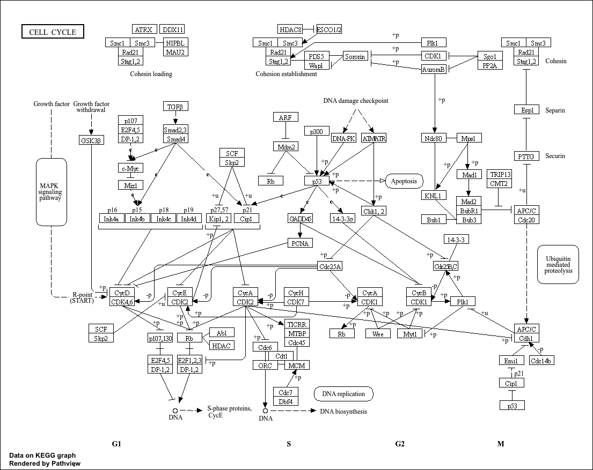

## Setup

```{r}
library(DESeq2)
```

## Differential Expression Analysis

```{r}
metaFile <- "data/GSE37704_metadata.csv"
countFile <- "data/GSE37704_featurecounts.csv"

colData = read.csv(metaFile, row.names=1)
head(colData)
```

```{r}
countData = read.csv(countFile, row.names=1)
head(countData)
```

Q1:

```{r}
countData <- as.matrix(countData[,-1])
head(countData)
```

Q2:

```{r}
countData <- countData[rowSums(countData) > 0, ]
head(countData)
```

Running DESeq2

```{r}
dim(countData)
dim(colData)
```

```{r}
countData <- read.csv(countFile, row.names=1)
countData <- countData[,-1]
countData <- as.matrix(countData)

colData <- read.csv(metaFile, row.names=1)

all(colnames(countData) == rownames(colData))
```

```{r}
dds <- DESeqDataSetFromMatrix(countData = countData,
colData = colData,
design = ~ condition)

dds <- DESeq(dds)
dds
```

```{r}
res = results(dds)
```

```{r}
summary(res)
```

Volcano Plot

```{r}
library(ggplot2)

ggplot(res) +
  aes(log2FoldChange,
      -log(padj)) +
  geom_point()
```

Improve color, labels, and cutoff:

```{r}

# Make a color vector for all genes
mycols <- rep("gray", nrow(res))

# Color blue the genes with fold change above 2
mycols[ abs(res$log2FoldChange) > 2 ] <- "blue"

# Color gray those with adjusted p-value more than 0.01
mycols[ res$padj > 0.01 ] <- "gray"

ggplot(res) +
aes(x = log2FoldChange,
    y = -log10(padj)) +
geom_point(col = mycols) +
xlab("Log2(FoldChange)") +
ylab("-Log(P-value)") +
geom_vline(xintercept = c(-2,2)) +
geom_hline(yintercept = -log10(0.01))
```

Gene annotation

```{r}
library("AnnotationDbi")
library("org.Hs.eg.db")

columns(org.Hs.eg.db)

res$symbol = mapIds(org.Hs.eg.db,
                    keys=row.names(res), 
                    keytype="ENSEMBL",
                    column="SYMBOL",
                    multiVals="first")

res$entrez = mapIds(org.Hs.eg.db,
                    keys=row.names(res),
                    keytype="ENSEMBL",
                    column="ENTREZID",
                    multiVals="first")

res$name = mapIds(org.Hs.eg.db,
                  keys=row.names(res),
                  keytype="ENSEMBL",
                  column="GENENAME",
                  multiVals="first")

head(res, 10)
```

```{r}
res = res[order(res$pvalue),]

write.csv(res, file="deseq_results.csv")
```

## Pathway Analysis

```{r}
library(pathview)
library(gage)
library(gageData)

data(kegg.sets.hs)
data(sigmet.idx.hs)

# Focus on signaling and metabolic pathways only
kegg.sets.hs = kegg.sets.hs[sigmet.idx.hs]

# Examine the first 3 pathways
head(kegg.sets.hs, 3)
```

```{r}
res <- results(dds)
head(res)
```

```{r}
foldchanges = res$log2FoldChange
names(foldchanges) = res$entrez
head(foldchanges)
```

```{r}
# Get the results
keggres = gage(foldchanges, gsets=kegg.sets.hs)
```

```{r}
attributes(keggres)
```

```{r}
head(keggres$less)
```

\

```{r}
## Focus on top 5 upregulated pathways here for demo purposes only
keggrespathways <- rownames(keggres$greater)[1:5]

# Extract the 8 character long IDs part of each string
keggresids = substr(keggrespathways, start=1, stop=8)
keggresids

```

```{r}
foldchanges <- res$log2FoldChange
names(foldchanges) <- res$entrez

foldchanges <- foldchanges[!is.na(names(foldchanges))]
foldchanges <- foldchanges[!is.na(foldchanges)]
```

```{r}
pathview(gene.data=foldchanges, pathway.id=keggresids, species="hsa")
```

```{r}

```

## Gene Ontology

```{r}
data(go.sets.hs)
data(go.subs.hs)
```

```{r}
gobpsets = go.sets.hs[go.subs.hs$BP]

gobpres = gage(foldchanges, gsets=gobpsets)

lapply(gobpres, head)
```

```{r}
gogres <- gage(foldchanges,
gsets = go.sets.hs,
ref = NULL,
samp = NULL)
```

Upregulated

```{r}
head(gogres$greater)
```

Downregulated

```{r}
head(gogres$less)
```

## Reactome Analysis

```{r}
library(AnnotationDbi)
library(org.Hs.eg.db)

res$symbol <- mapIds(org.Hs.eg.db,
keys=row.names(res),
keytype="ENSEMBL",
column="SYMBOL",
multiVals="first")
```

```{r}
library(ggplot2)

mycols <- rep("gray", nrow(res))

mycols[abs(res$log2FoldChange) > 2] <- "blue"
mycols[res$padj > 0.05] <- "gray"

ggplot(res, aes(x = log2FoldChange,
                y = -log10(padj))) +
geom_point(col = mycols) +
xlab("Log2(FoldChange)") +
ylab("-Log10(adjusted p-value)") +
geom_vline(xintercept = c(-2,2), linetype = 2) +
geom_hline(yintercept = -log10(0.05), linetype = 2)
```

```{r}
sig_genes <- res$symbol[res$padj < 0.05]

sig_genes <- sig_genes[!is.na(sig_genes)]
```

```{r}
write.table(sig_genes, file="significant_genes.txt", row.names=FALSE, col.names=FALSE, quote=FALSE)
```

**Top Pathway: Cell Cycle, Entities p-value: 2.6e-5**

The pathway with the most significant “Entities p-value” was the Cell Cycle pathway. Several of the top Reactome pathways matched the earlier KEGG results, particularly pathways related to the cell cycle and mitosis. Differences between Reactome and KEGG results can occur because the databases use different pathway definitions, gene annotations, and enrichment methods, which can change how genes are grouped and ranked statistically.

```{r}
sessionInfo()
```
